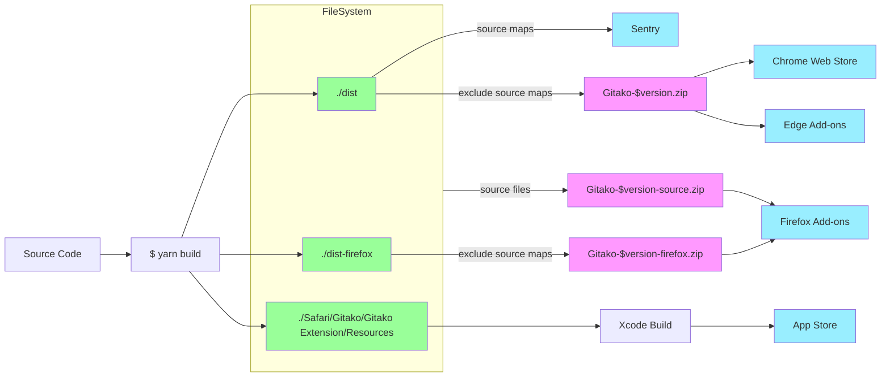

# Contributing

Thank you if you are trying to contribute!

Note: if you were using Windows, you may need to find alternatives for `make` commands. Or use WSL. I've not tested development on Windows and do not guarantee if it would work.

## Set up development env

1. Clone the repo
1. Run `make pull-icons` to install dependencies
1. Run `yarn` to install dependencies
1. Run `yarn dev` to start the development server, you'll see a `dist` folder appear in the root of this project
1. Open the extensions page in Chrome, enable developer mode, and load the extension from the `dist` folder
1. Navigate to repository of your choice and you should see the extension appear

When you modify source code, you need to do either of below to apply your changes:

- (recommended) use [the Extension Reloader extension](https://chrome.google.com/webstore/detail/fimgfedafeadlieiabdeeaodndnlbhid). It could reload all extensions then refresh the page (you need to enable it in its settings).
- manually reload the extension in the `chrome://extensions` and then refresh your repository page

## Develop with other browsers

Gitako supports Chrome, Edge, Firefox, and Safari. You can develop with other browsers by following the instructions below.

### Edge:

1. Finish the steps in "Set up development env" to `yarn dev`
1. Open the extensions page in Edge, enable developer mode, and load the extension from the `dist` folder
1. Navigate to repository of your choice and you should see the extension appear

### Firefox:

1. run `yarn dev`
   this will build Gitako with special Firefox configurations
1. run `yarn debug-firefox`
   a new instance of Firefox will open with Gitako automatically installed
1. navigate to a GitHub repo and you should see the extension appear
   if not, click the extension icon in the toolbar and enable Gitako in its submenu
1. when you modify source, better refresh the tab

### Safari (macOS only):

1. run `yarn dev`
1. Open `Safari/Gitako/Gitako.xcodeproj` in Xcode
1. Click the "Run" button
1. Enable developer mode in Safari's preferences
1. Enable Gitako in Safari's preferences
1. Open a Safari tab and visit a GitHub repo, then activate Gitako via Gitako icon next to the address bar
1. when you modify source, click the "Run" button in Xcode and refresh the tab

## Build for production

Run `make release` to build and release the extension

